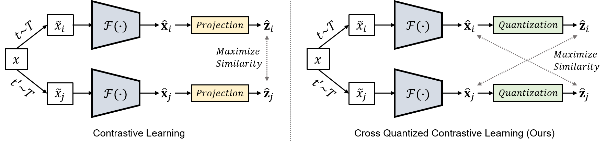
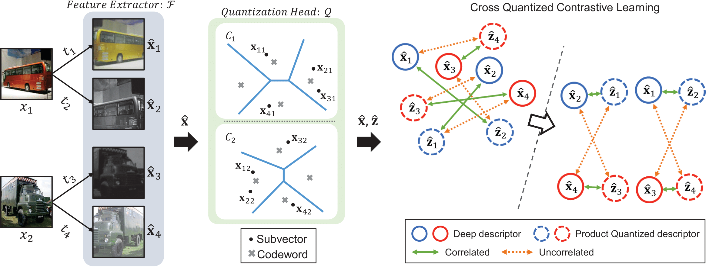

## Self-supervised Product Quantization for Deep Unsupervised Image Retrieval
Pytorch implementation of SPQ   
Accepted to ICCV 2021 - <a href="https://openaccess.thecvf.com/content/ICCV2021/papers/Jang_Self-Supervised_Product_Quantization_for_Deep_Unsupervised_Image_Retrieval_ICCV_2021_paper.pdf">paper</a>

>There is a typo in the paper, t_q should be 0.2 (in this implementation 5.0), because we wrote as division, not multiplication.

Young Kyun Jang and Nam Ik Cho  

## Abstract

Supervised deep learning-based hash and vector quantization are enabling fast and large-scale image retrieval systems. By fully exploiting label annotations, they are achieving outstanding retrieval performances compared to the conventional methods. However, it is painstaking to assign labels precisely for a vast amount of training data, and also, the annotation process is error-prone. To tackle these issues, we propose the first deep unsupervised image retrieval method dubbed Self-supervised Product Quantization (SPQ) network, which is label-free and trained in a self-supervised manner. We design a Cross Quantized Contrastive learning strategy that jointly learns codewords and deep visual descriptors by comparing individually transformed images (views). Our method analyzes the image contents to extract descriptive features, allowing us to understand image representations for accurate retrieval. By conducting extensive experiments on benchmarks, we demonstrate that the proposed method yields state-of-the-art results even without supervised pretraining.

## Concept

<p align="center"></p>

By maximizing cross-similarity between the deep descriptor of one view and the product quantized descriptor of the other, both codewords and deep descriptors are jointly trained to contain discriminative image content representations in SPQ.

## An illustration of training procedure in SPQ

<p align="center"></p>

## Training

### Install requirements on your environment.
- PyTorch=1.7.1
- kornia=0.5.10
- packaging=21.0
- torchvision=0.8.2
- tqdm=4.62.2

### Documentation
The explanation of arguments to reproduce the models presented in our paper can be found in the `args`, and by simply run:
```
python main_SPQ.py --help
```

### Vanilla SPQ training
- We utilize CIFAR-10 provided by torchvision in this work, and if not installed, please set the `--if_download=True`.
- We will provied pretrained models in the near futurue.
- To obtain the retrieval results reported in our paper, you need to train the model over 2,000 epochs with default setup. In order to train the model for 32-bit and compute mAP for every 100-th epoch, please run as:
```
python main_SPQ.py --gpu_id=0 --batch_size=256 --N_books=8 --N_words=16 --eval_epoch=100
```

## Citation
```
@inproceedings{SPQ,
  title={Self-supervised Product Quantization for Deep Unsupervised Image Retrieval},
  author={Young Kyun Jang, and Nam Ik Cho},
  booktitle={Proceedings of the International Conference on Computer Vision (ICCV)},
  year={2021}
}
```
